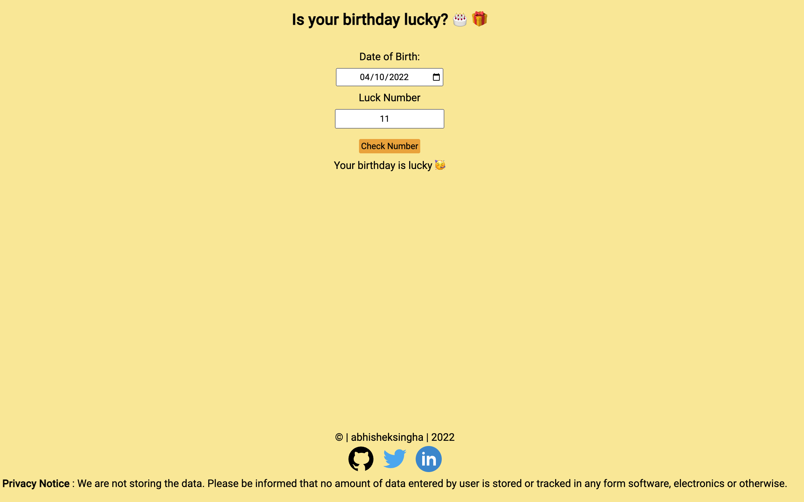

# is-your-birthday-lucky

A website which can help you to check whether your birthday is lucky or not. Just for fun not seriously.

## Demo -

You can view this app live here - [Demo](https://is-birthday-lucky-checker.netlify.app/)

## Tech Stack -

HTML, JavaScript, CSS for styling

## Documentation -

This app is built using HTML, JavaScript and CSS for styling. Helps user to check whether their birthday is lucky or not.

 Features -
- Take user's complete birthday as input.
- Take user's lucky number as input.
- Show the output if the birthdate is lucky or not to the user depending on the calculated results.
- Show the result to the user with some graphics icon.

## Screenshots -

## Author -

- Abhishek Singha - [abk9778singha](https://github.com/abk9778singha)

